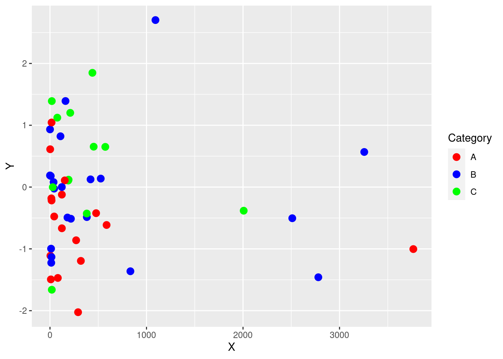
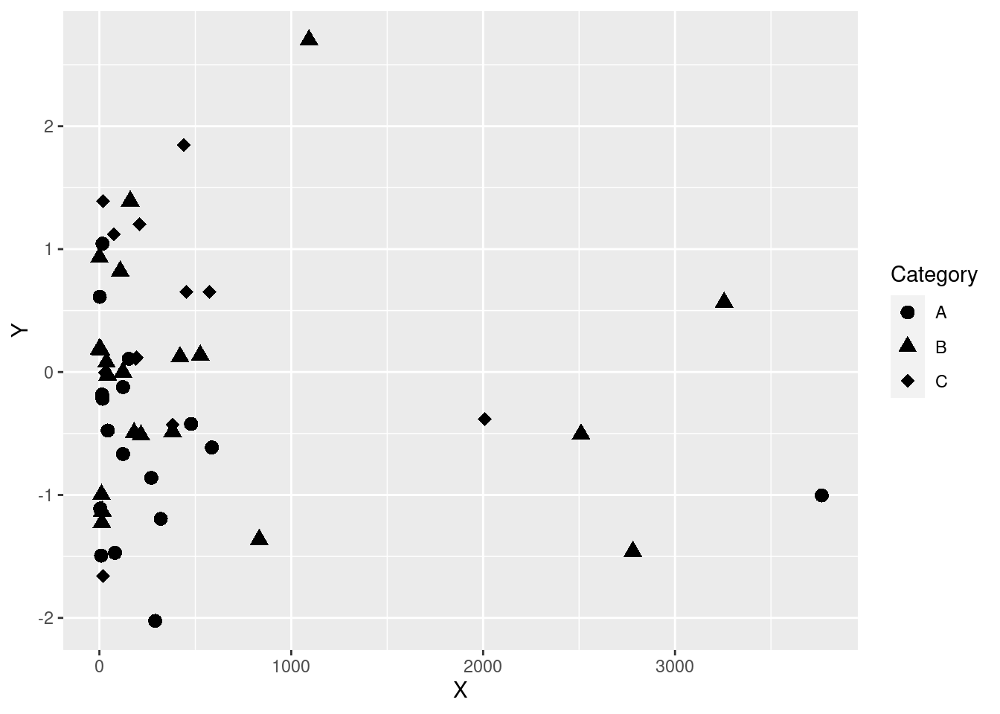
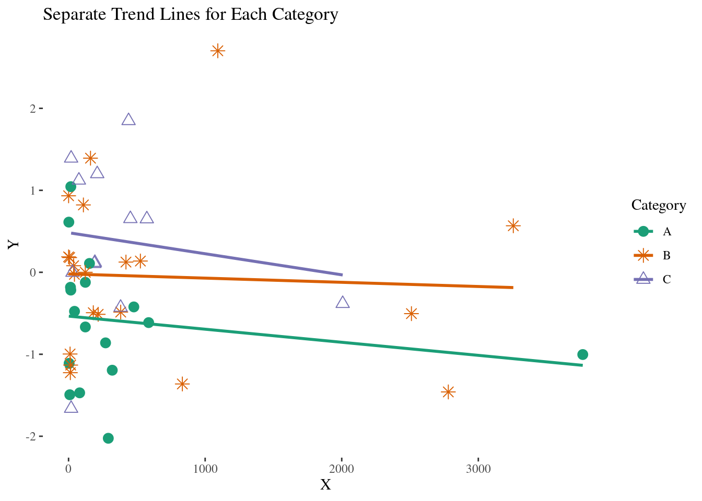
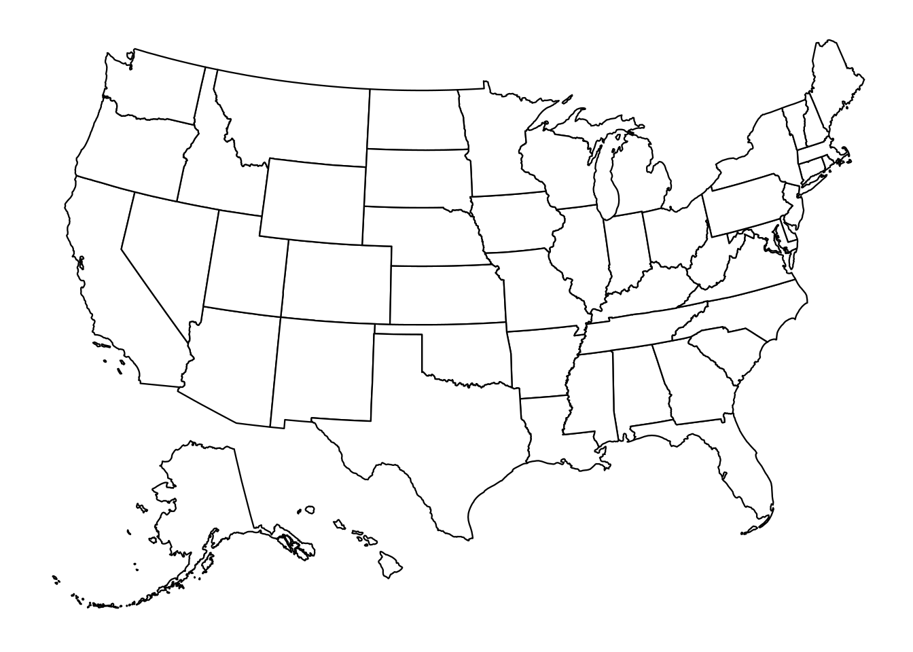
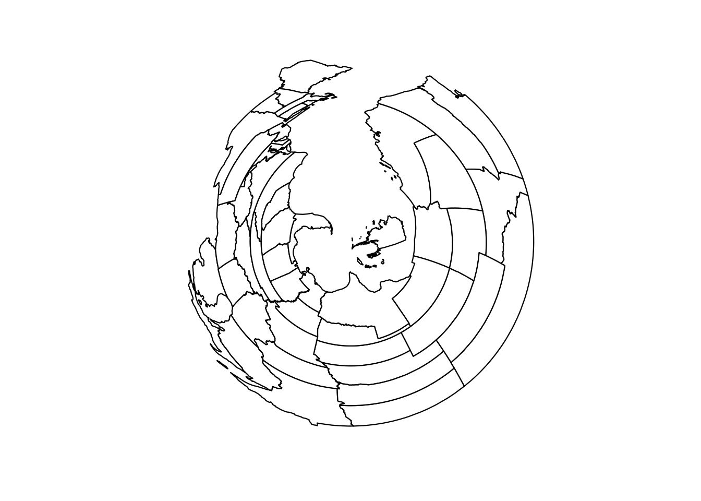
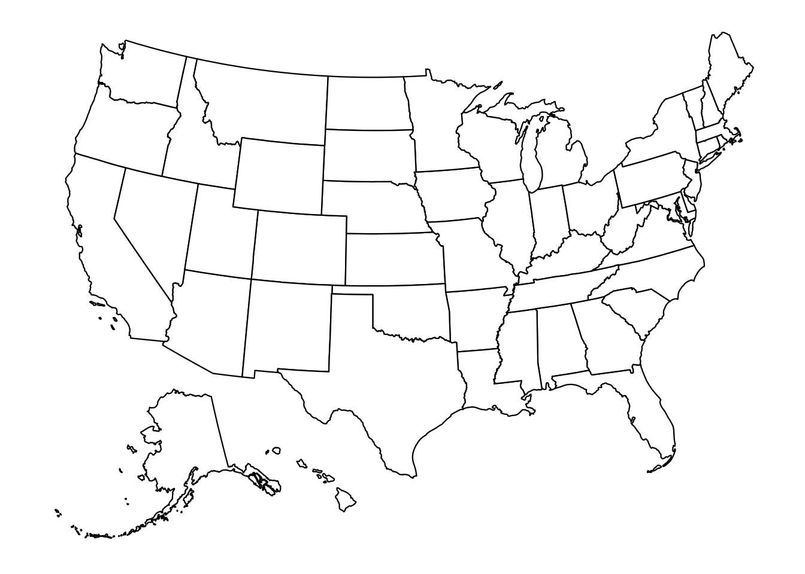
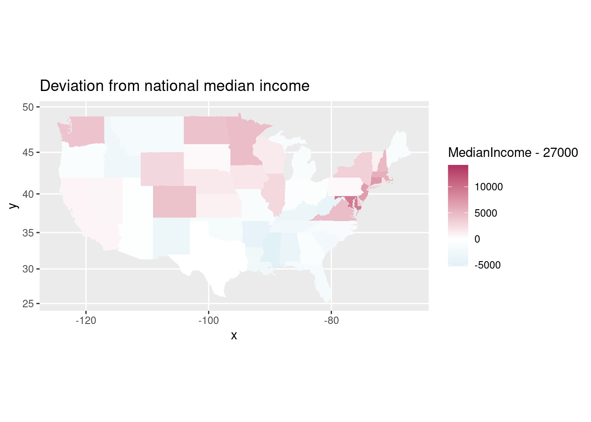
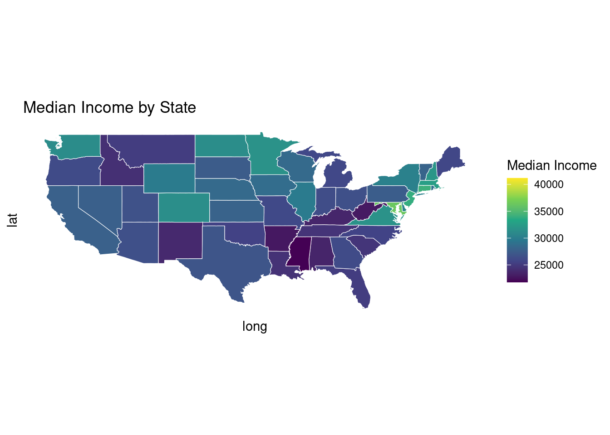

# Class Activity 5


```r
# Load the required libraries
library(tidyverse)
library(ggplot2)
library(ggthemes)
```


## Problem 1: Changing color and shape scales

In this problem, you will learn about the effects of changing colors, scales, and shapes in `ggplot2` for both gradient and discrete color choices. You will be given a series of questions and examples to enhance your understanding. Consider the following scatter plot


```r
# Generate sample data
set.seed(42)
data <- data.frame(
  Category = factor(sample(1:3, 50, replace = TRUE), labels = c("A", "B", "C")),
  X = 10 ^ rnorm(50, mean = 2, sd = 1),
  Y = rnorm(50, mean = 0, sd = 1)
)

p <- ggplot(data, aes(x = X, y = Y, color = Category)) +
  geom_point(size = 3)

p
```


a. Modify the scatter plot to use custom colors for each category using `scale_color_manual()`. What is the effect of changing the colors on the plot's readability?

<details>
<summary class="answer">Click for answer</summary>
*Answer:* Changing colors using `scale_color_manual()` allows for better distinction between categories and enhances the plot's readability.


```r
p <- ggplot(data, aes(x = X, y = Y, color = Category, group = Category)) +
  geom_point(size = 3) +
  scale_color_manual(values = c("A" = "red", "B" = "blue", "C" = "green"))
p
```



</details>


b. Modify the scatter plot to use custom shapes for each category using `scale_shape_manual()`. What is the effect of changing the shapes on the plot's readability?

<details>
<summary class="answer">Click for answer</summary>
*Answer:*  Changing the shapes using scale_shape_manual() helps to distinguish between categories and improves the plot's readability


```r
p <- ggplot(data, aes(x = X, y = Y, shape = Category,  group = Category)) +
  geom_point(size = 3) +
  scale_shape_manual(values = c("A" = 16, "B" = 17, "C" = 18))

p
```



</details>


c. Try modifying the plot by combining color, shape, and theme customizations. Additionally, try using `geom_smooth()` to add trend lines for each category. Pay attention to how each element affects the overall readability and interpretability of the plot.

<details>
<summary class="answer">Click for answer</summary>
*Answer:*


```r
# Base plot
p <- ggplot(data, aes(x = X, y = Y)) +
  geom_point(aes(color = Category, shape = Category), size = 3) + # Assign color and shape based on Category
  geom_smooth(aes(group = Category, color = Category), method = "lm", se = FALSE) + # Add trend lines for each category
  scale_shape_manual(values = c("A" = 19, "B" = 8, "C" = 24)) + # Customize shapes for categories
  scale_color_brewer(palette = "Dark2") + # Customize color palette
  ggthemes::theme_tufte() + 
  labs(title = "Separate Trend Lines for Each Category")

p
```



</details>

## Problem 2: US maps


Now, let's learn about the effect of changing various coordinate systems in `ggplot2` using a map example from the `usmap` package. We will explore the different types of coordinate systems available in ggplot2 and how they can be applied to the map visualization.


```r
#install.packages("usmap")   #uncomment to install
library(usmap)
```


### a. Plot a simple map of the United States using `ggplot2` and the `usmap` package.

<details>
<summary class="answer">Click for answer</summary>
*Answer:*


```r
us <- plot_usmap()
us
```



</details>

### b. Apply the `coord_flip()` function to the map to flip the x and y axes.

<details>
<summary class="answer">Click for answer</summary>
*Answer:*


```r
us_flipped <- us + coord_flip()
us_flipped
```


</details>


### c.  Apply the `coord_polar()` function to the map to transform the plot to a polar coordinate system

<details>
<summary class="answer">Click for answer</summary>
*Answer:*


```r
us_polar <- us + coord_polar()
us_polar
```



</details>

### d. Apply the `coord_quickmap()` function to the map to provide an approximation for a map projection.

<details>
<summary class="answer">Click for answer</summary>
*Answer:*


```r
us_quickmap <- us + coord_quickmap()
us_quickmap
```



</details>


## Problem 3: Chloropeth map

In today's class we created `cloropleth` maps of states in the US based on ACS data. 


```r
states <- map_data("state")
ACS <- ACS <- read.csv("https://raw.githubusercontent.com/deepbas/statdatasets/main/ACS.csv")
ACS <- dplyr::filter(ACS, !(region  %in% c("Alaska", "Hawaii"))) # only 48+D.C.
ACS$region <- tolower(ACS$region)  # lower case (match states regions)
```

### (a) Mapping median income

Create a `cloropleth` plot that uses color to create a `MedianIncome`  map of the US.

<details>
<summary class="answer">Click for answer</summary>
*Answer:*


```r
# map median income
ggplot(data=ACS) + coord_map() + 
  geom_map(aes(map_id = region, fill = MedianIncome), map = states) +
  expand_limits(x=states$long, y=states$lat) + ggtitle("Median Income")
```


</details>

### (b) Mapping deviations from national median income

The median income in the US in 2016 was estimated to be $27,000. Redraw your map in (a) to visualize each state's deviation from national median income. 

<details>
<summary class="answer">Click for answer</summary>
*Answer:*


```r
# compare state income to national income
ggplot(data=ACS) + coord_map() + 
  geom_map(aes(map_id = region, fill = MedianIncome - 27000), map = states) +
  expand_limits(x=states$long, y=states$lat) + ggtitle("Deviation from national median income")
```


</details>

### (c) Changing numerically scaled color

You should use a *diverging* color for (b) to highlight larger deviations from the national median. Add `scale_fill_distiller` to the map from (b) and select a diverging palette.   

<details>
<summary class="answer">Click for answer</summary>
*Answer:*


```r
# change to a diverging color
ggplot(data=ACS) + coord_map() + 
  geom_map(aes(map_id = region, fill = MedianIncome - 27000), map = states) +
  expand_limits(x=states$long, y=states$lat) + ggtitle("Deviation from national median income") + 
  scale_fill_distiller(type = "div")
```


</details>

### (d) Fixing a midpoint on a diverging scale

Use `scale_fill_gradient2` to fix a midpoint scale value at white color, with diverging colors for larger positive and negative values. Apply these colors to your map in (b) and fix the `midpoint` at an appropriate value. 

<details>
<summary class="answer">Click for answer</summary>
*Answer:*


```r
# change to a gradient fill color
ggplot(data=ACS) + coord_map() + 
  geom_map(aes(map_id = region, fill = MedianIncome - 27000), map = states) +
  expand_limits(x=states$long, y=states$lat) + ggtitle("Deviation from national median income") + 
  scale_fill_gradient2(
    low = "lightblue",    # Set the low color to red
    mid = "white", # Set the mid color to yellow
    high = "maroon", # Set the high color to green
    midpoint = 0
  )
```




</details>


### (e) Polygon map


```r
# Merge income data with geographic information
income_data <- left_join(states, ACS, by = c("region" = "region"))
```


Next, we will use this merged data to create a polygon map that focuses on the boundaries and shapes of each state, colored by median income.

#### Understanding Mercator Projection

The Mercator projection is a cylindrical map projection that was widely used for navigation charts because it represents lines of constant course, known as rhumb lines, as straight segments. However, this projection distorts the size of objects as the latitude increases from the Equator to the poles. For example, Greenland appears larger than Africa on a Mercator projection map, while in reality, Africa is about 14 times larger.

For this task, you will create a polygon map to visualize the `MedianIncome` across different states using the Mercator projection. Pay attention to the shapes and sizes of states as depicted on the map.


<details>
<summary class="answer">Click for answer</summary>


```r
library(sf)

ggplot(data = income_data) +
  geom_polygon(aes(x = long, y = lat, group = group, fill = MedianIncome), color = "white", size = 0.2) +
  coord_sf(crs = st_crs("+proj=merc +lon_0=0 +k=1 +x_0=0 +y_0=0 +datum=WGS84 +units=m +no_defs"), datum = NA) +
  labs(fill = "Median Income", title = "Median Income by State") +
  theme_minimal() +
  scale_fill_viridis_c()
```



</details>

### (f) Visualizing Relative Income Deviation with Robinson Projection

The Robinson projection is a map projection of a world map which shows the entire globe as if it were flat. It was specifically created in an attempt to find a good compromise to the problem of readily showing the whole globe as a flat image. The projection is neither equal-area nor conformal, abandoning both for a compromise. The Robinson projection is widely used for thematic and educational maps due to its visually pleasing representation of the Earth.

For this task, you will visualize the relative income deviation across states using the Robinson projection. Consider how the projection's compromise between size and shape affects the presentation of income data.

<details>
<summary class="answer">Click for answer</summary>


```r
# Calculate income deviation as a percentage
national_median <- 27000

# Merge the updated income data with geographic information
ACS$IncomeDeviationPercent <- ((ACS$MedianIncome - national_median) / national_median) * 100
income_data <- left_join(states, ACS, by = c("region" = "region"))

# Define the CRS for Robinson projection
robinson_crs <- st_crs("+proj=robin +lon_0=0 +x_0=0 +y_0=0 +datum=WGS84 +units=m +no_defs")

# Plot the income deviation using Robinson projection with geom_polygon
ggplot(data = income_data) +
  geom_polygon(aes(x = long, y = lat, group = group, fill = IncomeDeviationPercent), color = "white", size = 0.2) +
  coord_sf(crs = robinson_crs, datum = NA) +
  labs(fill = "Income Deviation (%)", title = "Income Deviation from National Median by State (%) (Robinson Projection)") +
  theme_minimal() +
  scale_fill_distiller(palette = "Spectral", name = "Deviation (%)")
```


</details>


