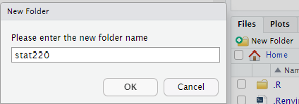
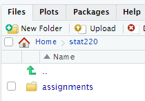
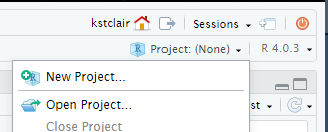
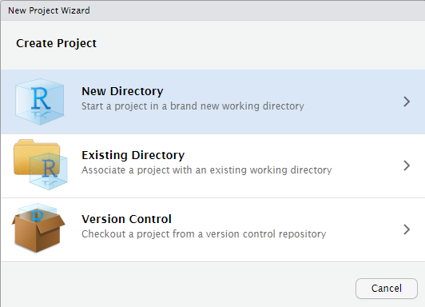
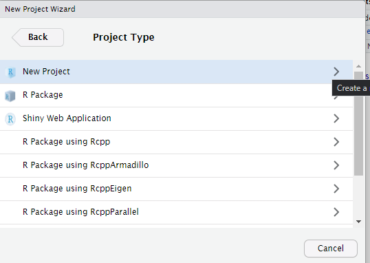
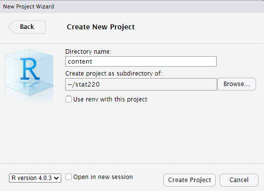

# Software in Stat 220 {#software}

You will work with many .Rmd Markdown files in this course. These include class activities, homework template, project helper files etc. To stay organized, I *strongly* suggest you create a **stat220** folder that contains the following subfolders:

-   **stat220** folder
    -   **Assignments:** This folder will contain subfolders for each
        assignment. Each assignment subfolder (e.g. homework1,
        homework2, …) will be a Github connected RStudio project that
        you will create **once an assignment is posted.**

    -   **Content:** This folder should be used to save any
        non-assignment files (e.g. slides, examples) for this class. You
        will create this subfolder by creating an RStudio project (see
        step 5 below).

To get started with this organization, follow the steps below.

------------------------------------------------------------------------

## File organization: Using maize

The server (online) version of Rstudio is run from a unix server. You
can navigate this file system using unix commands, but I assume that
most or all of you will just use Rstudio to access your files on this
server.

>
**1.** In Rstudio, click the **Files** *tab* in the lower right-hand
    window. Note: this is **not** the same as the **File** *menu*
    option.

> 
**2.** Verify that you are in your **HOME** folder (should simply
    say Home right under the New Folder button). To navigate to your
    Home folder (if somehow you are not in it), click the **…** button
    (far right side of the **Files** tab) and enter a \~ (tilde) symbol

-   **3.** Click the **New Folder** button and name the folder
    **stat220**.

-   **4.** Click on this newly created (empty) **stat220** folder.
    Within the folder create another **New Folder** and name it
    **assignments**.

-   **5.** Within the **stat220** folder, create an **RStudio project**
    called **content** with the following steps:

    -   **a.** Click the **Project** button in the upper righthand
        corner of your RStudio window and select **New Project…**.

-   **b.** Select **New Directory** and then **New Project**

-   **c.** Enter **content** as the **Directory name** and use the
    **Browse** button to find your **stat220** folder. Then click
    **Create Project**.

-   **d.** You should now have a new folder called **content** in your
    **stat220** folder and this folder will contain an RStudio project
    `.Rproj`. Feel free to add subfolders to this **content** folder
    (e.g. slides, examples, etc).

**Warning: Do not** create an RStudio project in the main stat220 folder
because it is not good practice to have RStudio projects in subfolders
of another project (e.g. a project within a project is not recommended).

------------------------------------------------------------------------

## File organization: Using your own Rstudio

Create a folder called **stat220** somewhere on your computer. Within
this folder create an **assignments** subfolder. Then complete **step
5** from above to create a **content** RStudio project folder.

------------------------------------------------------------------------

## RStudio projects

Once you’ve created a project, your R session should be running within
that project folder. You can check which project you are in by checking
the project name in the upper righthand part of your RStudio window.
Here we see the **content** project is open:

Running R from an RStudio project sets your **working directory** to the
project folder:

This allows for easy file path access to all files related to this
project.

To **start** a project, click on the `.Rproj` file or use the **Open
Project…** option shown in step 5 above.

------------------------------------------------------------------------

## Best practices (or what not to do)

-   Never save files to a lab computer hard drive (e.g. desktop,
    downloads, etc). They will be erased when you log off.
-   Do not use gmail as a file storage system! Avoid emailing yourself
    files that you created (and saved) on a lab computer. Eventually you
    will lose work this way.
-   Avoid using online versions of google drive and dropbox. Similar to
    gmail, downloading, editing a doc, then uploading it back to
    drive/dropbox is another great way to lose work.
-   Avoid [this](https://xkcd.com/1459/) and [this](http://phdcomics.com/comics.php?f=1531).

## Git and GitHub

[Git](https://happygitwithr.com/big-picture.html#why-git) is version
control software that you install locally on your computer. Git is
already installed on the maize RStudio server.

[Github](https://happygitwithr.com/big-picture.html#why-github) is a
cloud-based service for hosting git projects. It allows multiple users
to share and contribute to projects and it is how you will be submitting
homework assignments and projects for this class. More information about Git and
Github can also be found in [Getting setup with Git and
GitHub](https://rfortherestofus.com/2021/02/how-to-use-git-github-with-r/) and [Git and Github](https://sahirbhatnagar.com/rpkg/#gitgithub).

If you are using a local install of R/RStudio, then you will need to
install Git.

**Installing Git**

Directions for both Windows & Mac here:
<http://happygitwithr.com/install-git.html>.

> 
1. If you are using **maize**, then there is nothing you need to install.
2. Windows users should follow Option 1 in 6.2.
3. Mac users can follow Option 1 in 6.3 if comfortable, otherwise follow Option 2
4. Linux users can follow 6.4.

## Slack

We will use Slack for all course communication. [Sign up for our course
Slack team
here](https://join.slack.com/t/slack-eqx6534/shared_invite/zt-1rw47q6fp-pM9VWJLQ0obCGlGVgRvg2Q)!
You will need to create an account with a username, and log in to read
and post. You can download a
standalone Slack application to your
[Mac](https://slack.com/downloads/osx),
[Windows](https://slack.com/downloads/windows),
[Linux](https://slack.com/downloads/linux) and/or
[Android](https://slack.com/downloads/android)/[iOS](https://slack.com/downloads/ios)
device. You can control whether you receive notifications on new posts
by going to Preferences, as well as decide which 'channels' to subscribe
to. A 'channel' is a discussion thread, which is used to organize
communications into topics. You can learn more about Slack features
[here](https://slack.com/help/articles/218080037-Getting-started-for-new-Slack-users).

Several channels have been set up for specific parts of the course. Feel
free to ask questions anytime. You can browse the available channels in
our team by clicking on "Channels" on the left-hand panel.

## Acknowledgements

This installation guide is based on the guide from Adam Loy and Katie St. Clair.
